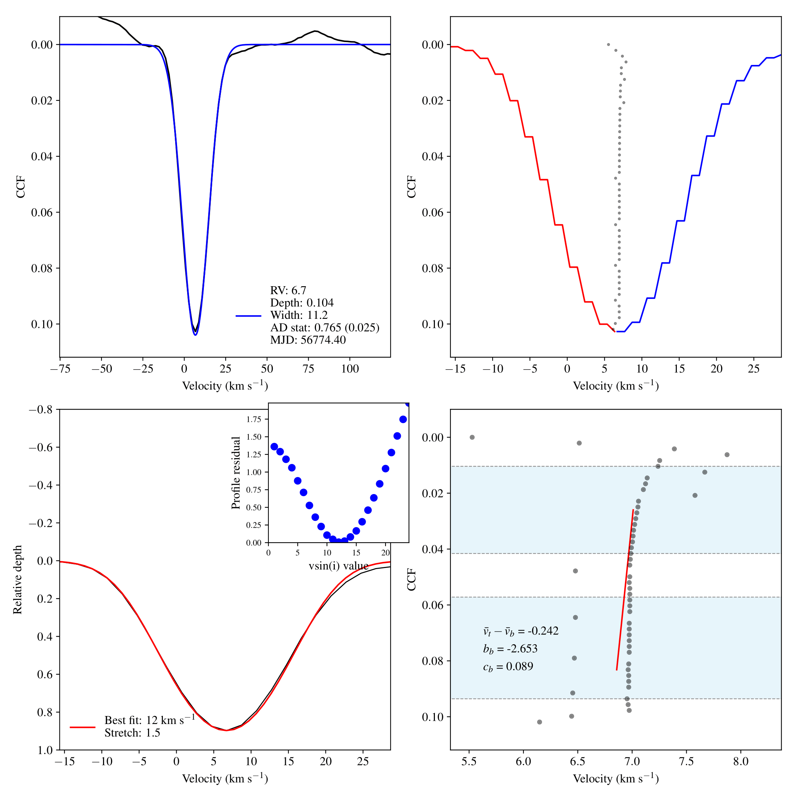

# CCF functions

Standalone CCF function for calculate radial velocity (RV), rotational velocity (vsini), bisector inverse slope (BIS), bisector slope and curvature from phase 3 spectra from UVES, HARPS and FEROS.

The code was originally developed by P. Elliott and then modified by A. Bayo and S. Zúñiga-Fernández and presented as a part of the article [Zúñiga-Fernández et al. 2021](https://ui.adsabs.harvard.edu/abs/arXiv:2010.08575), altough it has evolved since the paper was published.

